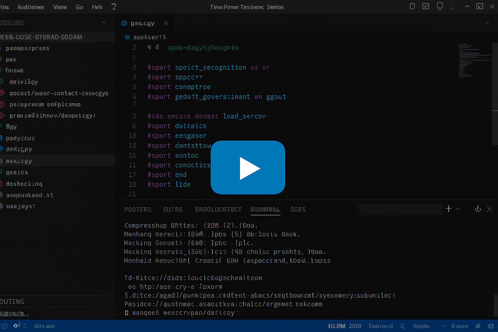

# Personal-AI-Assistant

A Personal AI Assistant is a smart digital assistant that can answer questions, support learning and productivity, and interact intelligently with users. Built using Object-Oriented Programming (OOP) principles and powered by the Gemini API, it delivers accurate, context-aware responses. The assistant features a clean and interactive user interface designed with Streamlit, making it easy to use, responsive, and effective for everyday tasks.

# Tech Stack:

- Python 3.10+
- Streamlit
- Google Gemini API
- Python-dotenv
- OOP Architecture

# How to run?
1. Create Environment
```bash
conda create -n jarvis python==3.11 -y
```
2. Activate Environment
```bash
conda activate jarvis
```
3. Create requirements.txt for installing required packages
```bash
pip install -r requirements.txt
```
4. Create Google API Key and store .env file because of hidden key.
5. Run the application 
```bash
streamlit run app.py
```

# Folder Structure :
```
Personal AI Assistant

├── jarvis/
│   ├── assistant.py
│   ├── gemini_engine.py
│   ├── prompt_controller.py
│   └── memory.py
├── .env
├── .gitignore
├── LINSENCE
├── README.md
├── requirements.txt
├── app.py
└── config/
    └── settings.py
```

#  Demo Video


[](https://drive.google.com/file/d/1aBdPU2iAjUg9ICgTZ15aIU_waxnYkqW6/view?usp=sharing)

# Sample Images


# Reference 
- https://pypi.org/project/SpeechRecognition/3.14.3/
- https://pypi.org/project/pyttsx3/2.90/
- https://pypi.org/project/PyAudio/0.2.14/
- https://pypi.org/project/wikipedia/1.4.0/
- https://pypi.org/project/google-generativeai/0.8.4/
- https://aistudio.google.com/api-keys
- https://pypi.org/project/python-dotenv/1.2.1/
- https://docs.python.org/3/library/logging.html
- https://tree.nathanfriend.com/
- https://docs.streamlit.io/


# 👨‍💻 Author
<b>Prodip Sarkar</b>

Linkedin - https://www.linkedin.com/in/prodip1023/

# 📜 License
This project is open-source and free to use for learning purposes.

